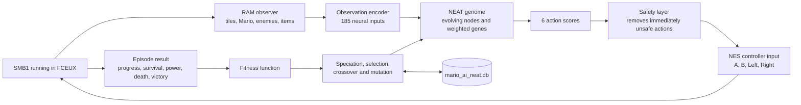
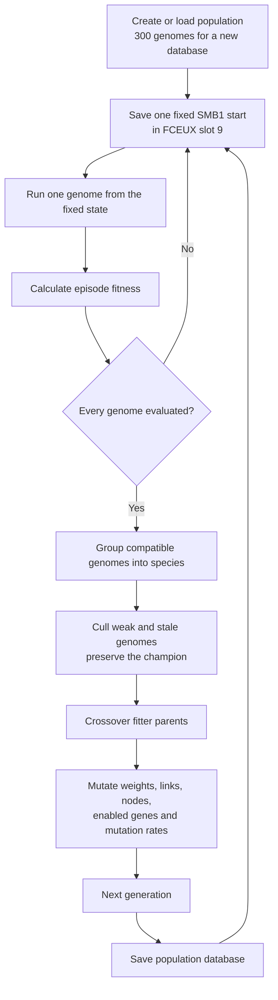

# Mario AI NEAT

A learning AI for **Super Mario Bros. 1 on NES, running in FCEUX**. It reads the SMB1 RAM layout, observes nearby tiles and enemies, and evolves a neural-network controller across repeated play attempts. Other games and emulators are outside the target.


*Live FCEUX training: the HUD explains the active NEAT genome, chosen action, sensed threat, progress, and saved-learning state.*

## What kind of AI is this?

Mario AI NEAT is a **NEAT-style neuroevolution system**, which is a form of machine learning. It uses an evolutionary reinforcement signal: neural-network controllers play SMB1, receive fitness from their results, and reproduce according to that fitness. It is not a language model, generative AI, Q-learning, PPO, or a network trained with backpropagation.

The controller is a hybrid system. NEAT learns which action to prefer, while a small deterministic safety layer removes immediately unsafe choices such as running directly into a close enemy. The learned neural network still decides whether to run, jump, brake, retreat, or walk among the allowed actions.

## Technology stack

| Layer | Technology | Role |
| --- | --- | --- |
| Game | NES Super Mario Bros. 1 | The only supported game; the ROM is not included |
| Emulator | FCEUX 2.x | Runs SMB1, exposes RAM, controller, frame, GUI, and savestate APIs |
| Runtime | Embedded Lua 5.1 | Executes the complete AI inside FCEUX |
| Machine learning | NEAT-style neuroevolution | Evolves neural-network connections, weights, nodes, and mutation rates |
| Reinforcement signal | Episode fitness | Rewards progress, survival, stronger forms, and victory; penalizes death and stalls |
| Model storage | `mario_ai_neat.db` | Persists generations, genomes, genes, innovation IDs, mutation rates, and fitness |
| Diagnostics | `mario_ai_neat.log` and FCEUX HUD | Records episodes and explains the live decision context |
| Verification | Lua behavior and mocked-FCEUX tests | Checks sensors, networks, evolution, persistence, compatibility, and controller behavior |

No Python process, ML framework, compiler, GPU runtime, cloud service, or network connection is required during training.

## AI architecture



### Observation and action model

| Neural interface | Size | Contents |
| --- | ---: | --- |
| Local grid | 169 | A 13×13 area around Mario: solid tile `1`, active enemy `-1`, empty space `0` |
| Global features | 15 | Velocity, grounded state, size/power, closest enemy, visible power-up, forward gap, contact danger |
| Bias | 1 | Constant input that lets actions activate without a particular sensor |
| **Total inputs** | **185** | Values evaluated by each genome every decision frame |
| Outputs | 6 | Run, running jump, retreat, brake, jump in place, controlled walk |

## How NEAT learns

Each genome is one candidate neural-network brain. A gene records a source node, destination node, weight, enabled state, and historical innovation ID. Innovation IDs let crossover align equivalent connections even after different genomes evolve different structures.



The implementation includes the main NEAT mechanisms:

- **Topology evolution:** mutations can add a connection or split an existing connection to create a hidden node.
- **Weight evolution:** connection weights are perturbed or replaced.
- **Historical markings:** innovation IDs align matching genes during crossover.
- **Speciation:** structural and weight distance separates different network families so new structures have time to improve.
- **Fitness sharing:** global rank is adjusted by species size before parent selection.
- **Crossover:** matching genes can come from either parent; unmatched structure follows the fitter parent.
- **Adaptive mutation:** mutation probabilities themselves drift slightly between generations.
- **Staleness control:** species that stop improving are removed after 15 generations unless they contain the global champion.
- **Elitism:** the strongest genome is copied unchanged into the next generation.
- **Seeded prior:** generation one begins with a small useful bias toward running and jumping for enemies or gaps; evolution may replace all of it.

### Why the project says “NEAT-style”

It implements NEAT's defining ideas—historical innovation numbers, topology growth, speciation, crossover, mutation, fitness sharing, and champion preservation—but it is specialized for SMB1 rather than a byte-for-byte copy of the original NEAT paper. Its six outputs select complete controller actions, the first genome has an SMB1 movement prior, fitness uses game progress and survival, and a deterministic safety layer rejects immediately dangerous actions. These choices make the learner practical inside FCEUX while keeping the neural policy and its topology trainable through evolution.

## Run and train

1. Open a compatible SMB1 NES ROM in FCEUX, preferably at the start of World 1-1.
2. Load `mario_ai_neat.lua` from FCEUX's Lua script menu.
3. Leave the script running. On the first active SMB1 frame it saves a fixed training start in FCEUX savestate slot 9. It then tests each genome from that same state, scores the attempt, breeds a new generation, and repeats.
4. Stop the script when you want. The population database is saved periodically, after every completed attempt, and when FCEUX stops the script. Leave the database beside the Lua script to continue learning later.
5. Read `mario_ai_neat.log` beside the script for startup, episode, and database-save events.

### Resume or restart training

`mario_ai_neat.db` is the learner's checkpoint. To resume, keep that file in the same directory as `mario_ai_neat.lua`, leave `PLAY_CHAMPION_ONLY = false`, open the same SMB1 ROM in FCEUX, and load the Lua script again. The AI loads the saved generation, genomes, mutation rates, connection weights, innovation IDs, and fitness values before starting the next episode. Stopping FCEUX is safe because the script saves after episodes, at periodic checkpoints, and during the exit callback.

The repository includes a small, valid starter database so the script can be run immediately. It is an untrained population checkpoint, not a claim of a mature model. Copy the database before experiments if you want a backup. To start over, stop FCEUX, remove `mario_ai_neat.db`, and load the script; a fresh 300-genome population is created automatically. To preserve a trained model, copy the database to a dated backup and restore it beside the script before launching FCEUX.

To play the saved champion without changing the database, set `PLAY_CHAMPION_ONLY = true`, load the script, and begin SMB1 manually. Set it back to `false` and reload the script to resume evolution from the same database.

The AI uses FCEUX's predefined slot 9 for fair training episodes. This overwrites that slot, so reserve it for Mario AI NEAT. It uses `savestate.object()` when available and the older `savestate.create()` compatibility API otherwise. It never calls `savestate.persist()`, the native FCEUX function that crashed on the Homebrew Apple Silicon build. If a FCEUX build has no compatible savestate API, the AI logs the condition and continues with less-controlled input-only episodes.

New databases contain 300 genomes. Existing databases retain their current population size so that previous learning is not discarded. Delete `mario_ai_neat.db` to begin a new 300-genome run.

## Champion play

After training, set `local PLAY_CHAMPION_ONLY = true` near the top of `mario_ai_neat.lua`. The AI loads the genome with the highest saved fitness and repeatedly plays it from slot 9 without mutation, crossover, or generation changes. Set it back to `false` to resume training.

## Testing aids

The current testing build refreshes the SMB1 timer to `999` while gameplay is active and refreshes the lives byte at `0x075A` to `9`. This prevents a training run from reaching Game Over, while SMB1 still performs every normal death and respawn. The AI never presses Start automatically; begin a game manually in FCEUX. Before a real evaluation, change `TESTING_FREEZE_TIMER` and `TESTING_INFINITE_LIVES` near the top of `mario_ai_neat.lua` to `false`.

## What it senses and learns

The AI uses the SMB1 positions and tile data from the legacy script and MarI/O's SMB1 sensor layout: a nearby tile/enemy grid plus Mario movement and power state. The neural network scores controller actions. A safety filter removes forward-only actions when an unpowered Mario is close to an enemy, while preserving learned choices such as jumping, braking, and retreating. The original controller's jump-over-ground-enemies and fire-as-Fire-Mario behaviors inform that filter.

Each attempt earns fitness for furthest forward progress and survival, with a large bonus for reaching the flag. Completed generations retain a champion, group related genomes into species, select fitter parents, cross over matching genes, and mutate connections and weights. This is evolutionary reinforcement learning: the learned population persists in the database and is evaluated during real SMB1 play sessions.

The FCEUX overlay shows the active generation, genome, species, current lesson, chosen action, observed threat or gap, progress, and database status. It does not show testing-aid settings.

The implementation is inspired by the MarI/O approach, but does not redistribute its code. The supplied MarI/O gist says its code may be used but should not be redistributed. This project implements its own NEAT-style trainer and adapts the sensor/runtime to FCEUX SMB1.

## Tests and limitations

```sh
sh tests/run.sh
```

Tests cover neural-network evaluation, enemy sensors, enemy safety filtering, population save/load, generation breeding, the FCEUX compatibility layer, and the controller loop. RAM writes are restricted to the documented testing timer and lives aids. Tests do not establish that a learned genome beats the game. See [evaluation](docs/evaluation.md), [learning](docs/learning.md), [limitations](docs/limitations.md), and [RAM map](docs/ram-map.md).

The target RAM layout is the SMB1 revision described by the original bot and the linked [SMB disassembly](https://gist.github.com/1wErt3r/4048722). Other revisions and ROM hacks are not validated.

## Files

- `mario_ai_neat.lua`: self-contained FCEUX SMB1 AI, sensors, NEAT trainer, episode loop, and database persistence.
- `legacy/LuaRio_Bot_v1.lua`: original bot preserved byte-for-byte.
- `docs/learning.md`: training loop, fitness, genome database, and restart behavior.
- `docs/requirements-and-weaknesses.md`: behavior inventory and remaining risks.
- `docs/ram-map.md`: inherited RAM addresses and verification status.

The legacy header credits Haseeb Mir, SethBling, and doppelganger. The original file did not declare a license, so this repository does not add one without rights confirmation.
