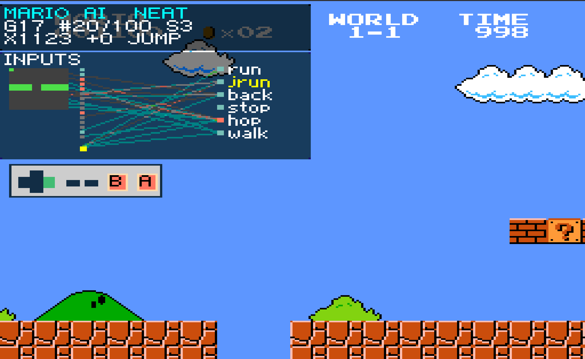
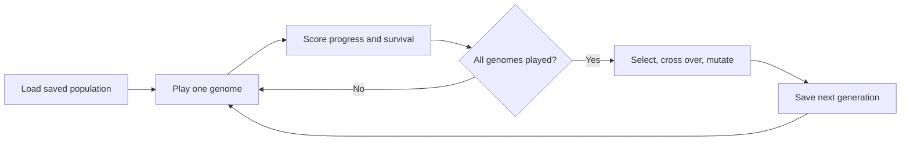
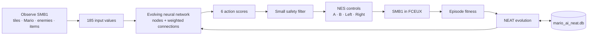
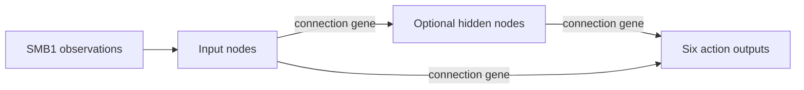
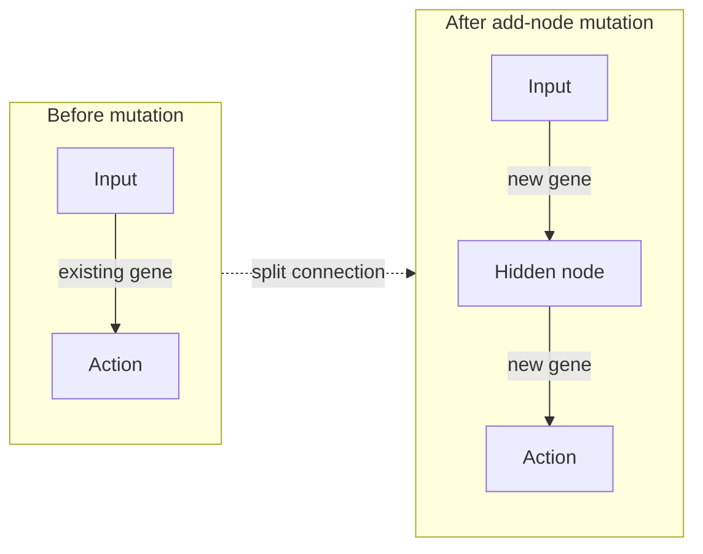
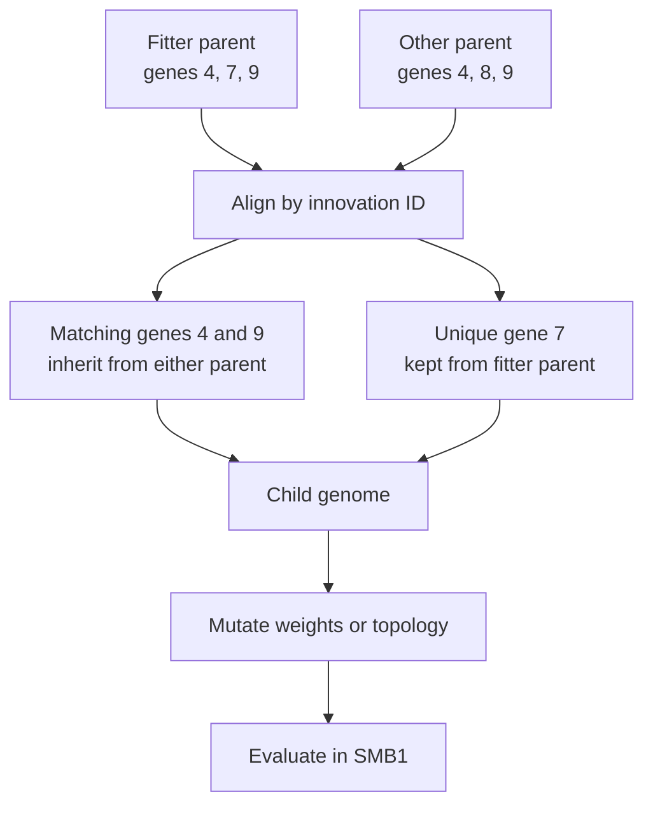

# Mario AI NEAT

An AI that learns to play **Super Mario Bros. 1 for NES in FCEUX**. It uses NEAT to evolve a neural network that chooses Mario's actions over repeated attempts.

> **Project scope:** SMB1 for NES, in FCEUX. The AI is based on SethBling's MarI/O learning approach for Super Mario World, adapted for this game and emulator.

## See it in action



*Mario AI playing SMB1 in FCEUX. The compact overlay shows the active genome, nearby input grid, network connections, selected action, and a mini NES controller while the game remains visible.*

Click the video thumbnail to watch SethBling's MarI/O video. MarI/O plays Super Mario World; this project targets SMB1 in FCEUX.

[](https://www.youtube.com/watch?v=qv6UVOQ0F44)

## What it does

- Reads Mario, nearby tiles, enemies, and items from SMB1 memory.
- Chooses among six actions, including run, jump, retreat, brake, and walk.
- Scores each attempt for progress and survival, then evolves the population.
- Saves learning in `mario_ai_neat.db` so later sessions can continue from the saved population.

## Start playing and training

1. Open a compatible **Super Mario Bros. 1 NES ROM** in FCEUX. The ROM is not included.
2. Keep `mario_ai_neat.lua` and `mario_ai_neat.db` together in one folder.
3. Load `mario_ai_neat.lua` from FCEUX's Lua script menu. The script finds and loads the adjacent database automatically.
4. Start the game manually. The AI will evaluate genomes and save progress as it trains.

The `.db` file is a learning checkpoint, not a script. Do not load it through the Lua menu. To resume later, load the Lua script again with the same database beside it. Leave `PLAY_CHAMPION_ONLY = false` to continue training.

### Training loop

Each genome plays from the same saved starting point. After all genomes have played, the AI uses their results to build the next generation.



## Resume, start over, or play the champion

### Resume training

The included `mario_ai_neat.db` is a generation 35 population checkpoint. Keep it beside `mario_ai_neat.lua`, load the SMB1 ROM, then start the Lua script in FCEUX. It automatically loads the population and continues training. The script uses this exact filename; it does not automatically find `mario_ai_heaven_neat.db` or other database names.

If the log says `discarded unsafe training start`, the saved FCEUX slot was too close to a death. The AI leaves that slot, waits for Mario's normal respawn, and records a new start. It does not press Start or score that short failed attempt. If the game remains on a title or game-over screen, start the game manually; the AI never presses Start for you.

To use a checkpoint with a different name, stop the Lua script, back up the checkpoint, and copy it beside the Lua file as `mario_ai_neat.db`. Do not replace the database while the script is running.

### Start a fresh population

Stop the script and move `mario_ai_neat.db` to a backup location. The next launch creates a new population of 300 genomes. Existing databases keep their saved population size.

### Play the best saved genome

Set `PLAY_CHAMPION_ONLY = true` near the top of `mario_ai_neat.lua`, then load the script. It plays the highest-fitness saved genome without evolving the population. Set it to `false` and reload to resume training.

## What you'll see and what to expect

Mario AI evolves candidate controllers; it does not understand the game like a person or learn language. Early attempts may die or make little progress. Fitness favors reaching farther, surviving, keeping power-ups, and completing the level. The overlay shows the active genome, input grid, network connections, selected action, pressed buttons, and progress. Click the upper-right corner of the FCEUX screen to hide the overlay, then click **[AI]** there to show it again.

Training time and results depend on the ROM, starting point, and number of attempts. A higher generation number means more rounds of evaluation and evolution; it does not guarantee that the AI can finish the level.

## Technical details

The sections below describe the learning method and implementation. You can use the project without reading them.

### Neural network at a glance

The network receives a fixed SMB1 observation and scores six actions. NEAT evolves its connection weights and can add hidden nodes as it learns.



| Network input | Count | Example contents |
| --- | ---: | --- |
| Local tile grid | 169 | 13×13 area around Mario: solid tiles, enemies, and empty space |
| Mario and nearby-object features | 15 | Velocity, grounded state, power, enemy/item distances, gaps, and contact danger |
| Bias | 1 | Constant input |
| **Total inputs** | **185** | Values passed to each genome |
| **Outputs** | **6** | Run, running jump, retreat, brake, jump in place, controlled walk |

The safety filter can block an immediately unsafe choice, such as running into a nearby enemy as small Mario. It leaves the neural network to choose among the remaining actions.

### What changes as the AI evolves

A **genome** is one candidate neural-network controller. Nodes represent inputs, optional hidden neurons, and actions. Each connection is stored as a gene with a weight, enabled state, and historical innovation ID.



An add-node mutation splits a connection: the old gene is disabled, a hidden node is inserted, and two new connection genes are added.



After scoring, similar genomes are grouped into species. Parents are chosen within species, matching genes are aligned by innovation ID, and unmatched genes come from the fitter parent. The child is then mutated.



### NEAT mechanisms in this implementation

- **Topology and weight mutation:** add connections, split connections to add nodes, and change weights.
- **Historical markings:** innovation IDs identify corresponding genes during species comparison and crossover.
- **Speciation and fitness sharing:** group related genomes and adjust their selection scores by species size.
- **Crossover:** inherit matching genes from either parent; unmatched genes follow the fitter parent.
- **Elitism and staleness control:** preserve the champion and remove stagnant species after 15 generations unless they contain the champion.
- **Seeded starting behavior:** the first population starts with a small SMB1 movement prior that evolution can change.

This is a specialized NEAT-style implementation, not a byte-for-byte implementation of the NEAT paper. It uses six complete action choices, SMB1-specific fitness, a seeded starting policy, and a safety filter.

### FCEUX and testing notes

- The Lua script uses FCEUX's embedded Lua runtime and FCEUX APIs. This project currently targets **FCEUX only**.
- Training uses savestate slot 9 as a shared starting point. Reserve that slot for Mario AI.
- The script supports `savestate.object()` and the older `savestate.create()` API. It does not call `savestate.persist()`.
- Testing aids currently set the in-game timer to `999` and refresh lives to `9`. Disable `TESTING_FREEZE_TIMER` and `TESTING_INFINITE_LIVES` in the Lua file for evaluation without those aids.
- The AI never starts a game after death. Start the game manually in FCEUX.

### Technology stack

| Part | Technology |
| --- | --- |
| Game | Super Mario Bros. 1 for NES |
| Emulator | FCEUX 2.x |
| Runtime | Embedded Lua 5.1 |
| Learning | NEAT-style neuroevolution with episode fitness |
| Checkpoint | Plain-text `mario_ai_neat.db` |
| Logging | `mario_ai_neat.log` and FCEUX HUD |

No Python process, ML framework, compiler, GPU, cloud service, or network connection is needed while training.

## Sources and attribution

- [MarI/O source by SethBling](https://gist.github.com/d12frosted/7471e2123f10485d96bb) and [the MarI/O video](https://www.youtube.com/watch?v=qv6UVOQ0F44). MarI/O demonstrates NEAT playing Super Mario World; this project adapts the approach to SMB1 on NES in FCEUX. This repository does not redistribute MarI/O source code.
- Kenneth O. Stanley and Risto Miikkulainen, [“Evolving Neural Networks through Augmenting Topologies”](https://direct.mit.edu/evco/article/10/2/99/1123/Evolving-Neural-Networks-through-Augmenting), *Evolutionary Computation*, 10(2), 99–127 (2002).
- SMB1 RAM map reference: [Super Mario Bros. disassembly](https://gist.github.com/1wErt3r/4048722). The target RAM layout is not validated for other ROM revisions or hacks.

## Tests and project files

Run the tests with:

```sh
sh tests/run.sh
```

Tests cover network evaluation, enemy sensors and safety, population persistence and evolution, FCEUX compatibility, and controller behavior. Tests do not prove that a trained genome can beat the game.

- `mario_ai_neat.lua` — self-contained SMB1 AI, NEAT trainer, FCEUX loop, and persistence.
- `mario_ai_neat.db` — included population checkpoint; keep it beside the Lua file to resume.
- `docs/images/mario-ai-neat-training.png` — main FCEUX screenshot used above.
- `docs/learning.md` — detailed training and persistence notes.
- `docs/limitations.md` and `docs/ram-map.md` — known limitations and SMB1 memory references.
