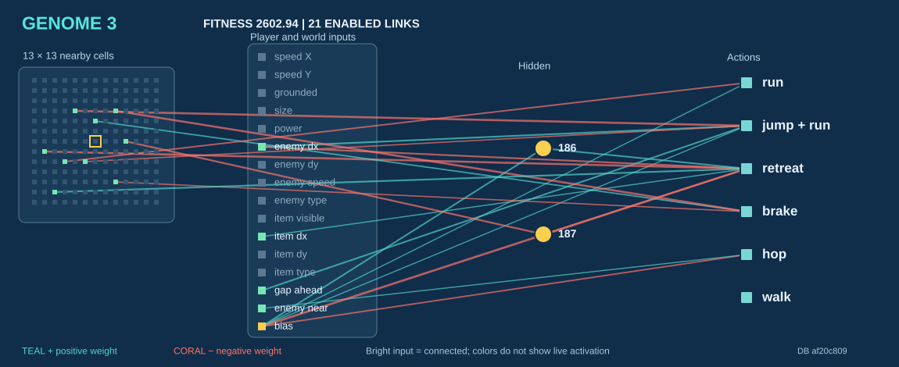
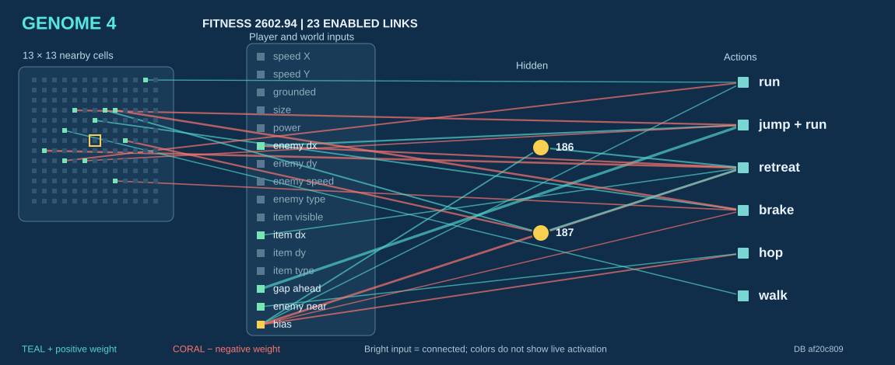
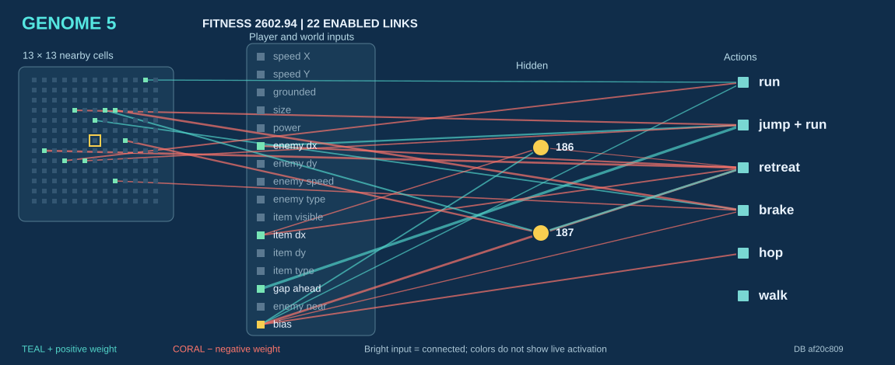
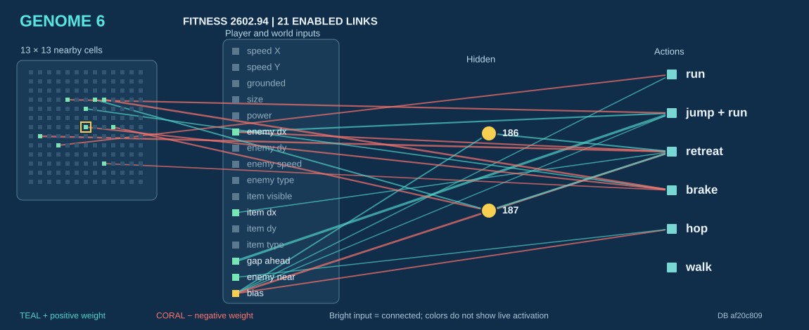
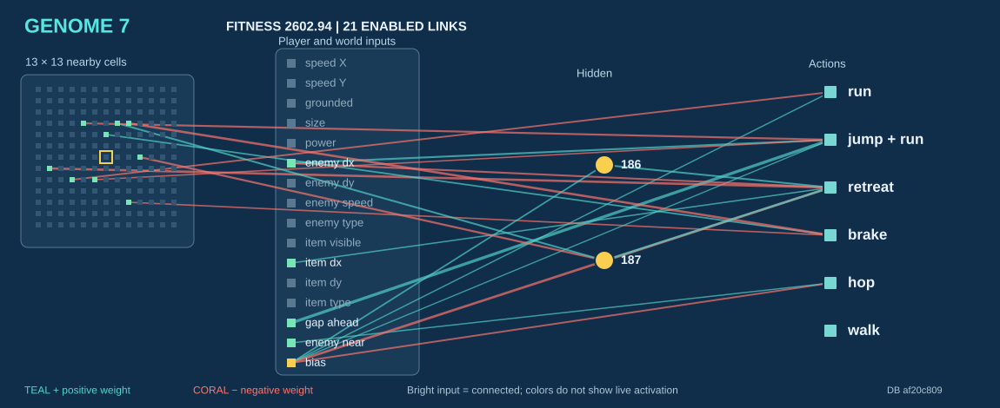

# Five networks from the saved population

These are the five highest scored genomes in the committed [training database](../mario_ai_neat.db), generation **35**. All five scored **2602.94**; ties are listed by genome number. They are similar because NEAT produced variants of a successful parent. This is a snapshot of training results, not proof that any genome can finish a level.

| Genome | Fitness | Enabled links | Gap → running jump | Hidden 187 → retreat |
| --- | ---: | ---: | ---: | ---: |
| **3** | 2602.94 | 21 | +1.25 | −0.50 |
| **4** | 2602.94 | 23 | +3.04 | +1.89 |
| **5** | 2602.94 | 22 | +3.09 | +1.93 |
| **6** | 2602.94 | 21 | +3.04 | +1.89 |
| **7** | 2602.94 | 21 | +3.02 | +1.85 |

The numbers in the last two columns are actual connection weights, rounded to two decimals. All five networks also contain hidden nodes 186 and 187. A positive weight raises a node's input when its source is positive; a negative weight lowers it. The final action also depends on the other links, node activation, and the AI's close-threat action filter.

## The five complete diagrams

Each image shows **every enabled connection** in that saved genome, like the compact network display in FCEUX. The 13 × 13 squares on the left represent nearby game cells; the next column contains player and world inputs. Yellow circles are hidden nodes, and the right column lists possible actions. Teal lines have positive weights and coral lines have negative weights. Bright input squares are connected inputs, **not live sensor activations**.

### Genome 3

Its gap-to-jump link is weaker than the other four, and hidden node 187 has a negative connection to retreat.

### Genome 4

This one has the most enabled links of the five. A detected gap strongly feeds the running-jump action; enemy position also feeds jump and retreat with opposite signs.

### Genome 5

Its gap-to-jump link is +3.09, the strongest of these five, and hidden node 187 feeds retreat at +1.93.

### Genome 6

It closely resembles genome 4, with two fewer enabled links. Its bias-to-running-jump link is enabled; genome 4 has that link disabled.

### Genome 7

It keeps the same main gap, enemy, and hidden-node paths with slightly different weights. It earned the same saved fitness as the others.

The database header's `4336.78` is the population's **historical best fitness**, not the current fitness of these five genomes. Fitness values are comparable for attempts from the same training start; changing the starting point changes the task being scored.

**Source:** `mario_ai_neat.db` at SHA-256 `af20c809267307e56eb4c785b303c4f34c3aec26d0779800ae13007b66703335`. The images use every enabled `N` record for each genome; scores come from `G` records. Input and output names follow [`mario_ai_neat.lua`](../mario_ai_neat.lua). Regenerate the images with [`scripts/render_network_diagrams.py`](../scripts/render_network_diagrams.py) after changing the database.
