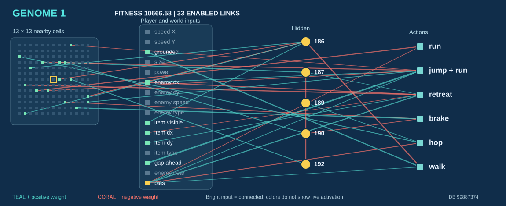
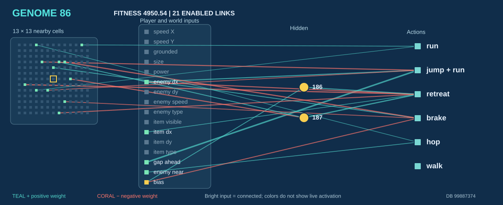
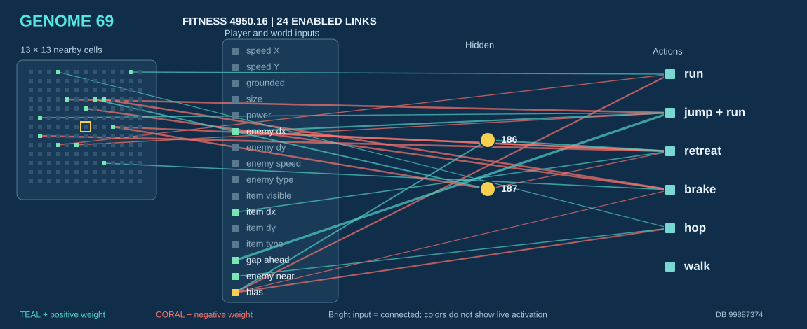
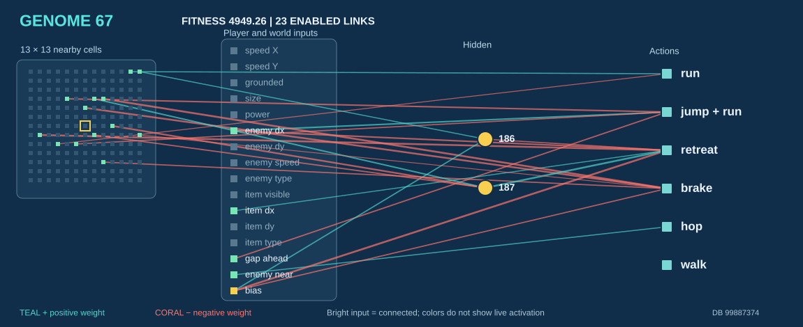
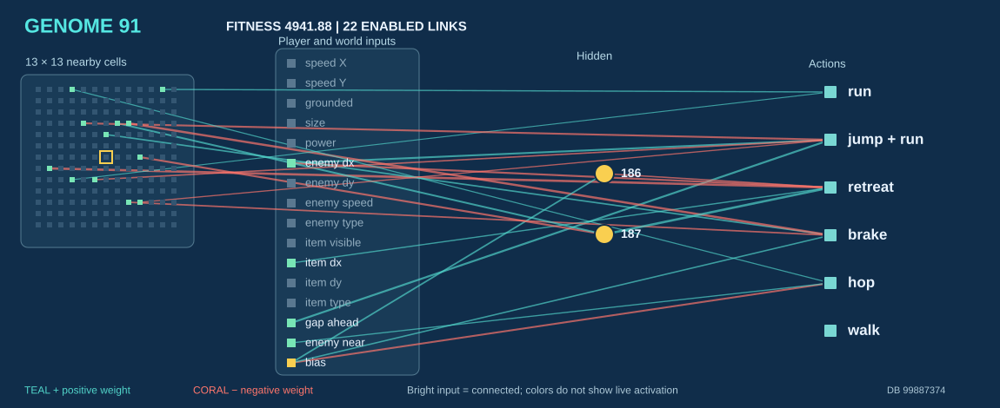
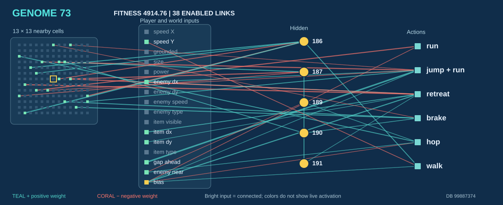
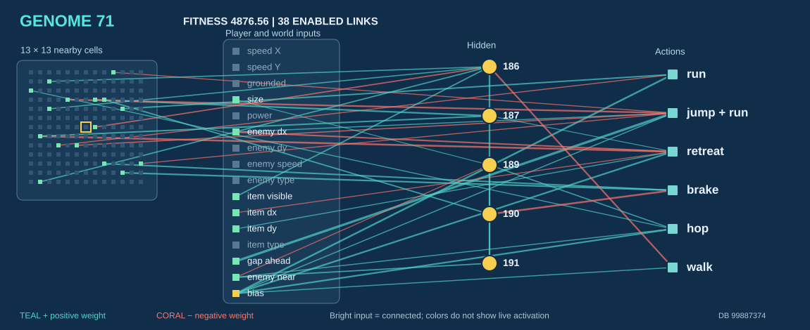

# Seven networks from the saved population

These diagrams come from the committed [generation 37 training database](../mario_ai_neat.db). The first five have the highest saved fitness. The final two are the **most connected remaining genomes**, included to show more complex networks. This is a fixed snapshot of training results; a high score alone does not prove that a network can finish a level.

| Group | Genome | Saved fitness | Enabled links | Hidden nodes |
| --- | ---: | ---: | ---: | --- |
| Best 1 | **1** | 10666.58 | 33 | 186, 187, 189, 190, 192 |
| Best 2 | **86** | 4950.54 | 21 | 186, 187 |
| Best 3 | **69** | 4950.16 | 24 | 186, 187 |
| Best 4 | **67** | 4949.26 | 23 | 186, 187 |
| Best 5 | **91** | 4941.88 | 22 | 186, 187 |
| More links | **73** | 4914.76 | 38 | 186, 187, 189, 190, 191 |
| More links | **71** | 4876.56 | 38 | 186, 187, 189, 190, 191 |

Each image shows **every enabled connection** in its saved genome, in the style of the FCEUX network display. The 13 × 13 squares on the left represent nearby game cells; the next column contains player and world inputs. Yellow circles are hidden nodes, and the right column lists actions. Teal lines have positive weights and coral lines have negative weights. Bright input squares are connected inputs, **not live sensor activations**.

## Five highest scored networks

### 1. Genome 1

This is the highest scoring genome in the snapshot. Its 33 links include a gap-to-running-jump connection (+2.81) and a grounded-to-walk connection (+1.80). It has five hidden nodes.

### 2. Genome 86

A detected gap feeds running jump (+3.02). Enemy position feeds running jump (+1.49) and retreat (−1.53) with opposite signs.

### 3. Genome 69

Its gap-to-running-jump link is +3.18, the strongest of the five highest scored networks. Enemy position connects to retreat at −2.02.

### 4. Genome 67

This network has a negative bias-to-retreat link (−2.11), while hidden node 187 feeds retreat positively (+1.89).

### 5. Genome 91

Hidden node 187 has a strong positive connection to retreat (+2.02). A gap still feeds running jump, but with a smaller weight (+1.50) than in genomes 86 and 69.

## Two more complex networks from the same generation

### Genome 73 · 38 enabled links

One of the two most connected additional genomes. It has five hidden nodes; a grid cell connects to hidden node 186 at +1.86, and a gap feeds running jump at +2.96.

### Genome 71 · 38 enabled links

It has the same link count and five hidden nodes, but a different structure. Hidden node 186 feeds hidden node 191 (+1.70), and hidden node 190 feeds brake negatively (−1.91).

The lines show learned weights, not an action taken in a particular frame. The AI evaluates the network and then applies its close-threat action filter before pressing controller buttons. Starting from a different point also changes the task behind the fitness score.

**Source:** `mario_ai_neat.db` at SHA-256 `998873748075d23bc78c1db84ed58ea779f6c887c07537306a3a54724325ede5`. The images use every enabled `N` record for each genome; scores come from `G` records. Input and output names follow [`mario_ai_neat.lua`](../mario_ai_neat.lua). Regenerate the images with [`scripts/render_network_diagrams.py`](../scripts/render_network_diagrams.py) after changing the database.
