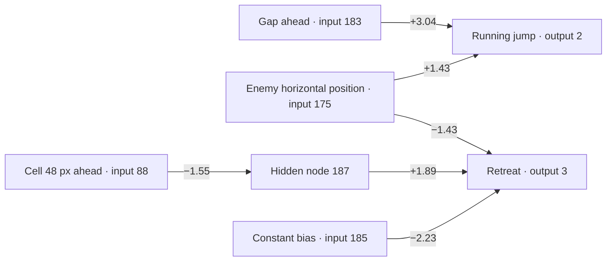

# Five networks from the saved population

These are the five highest scored genomes in the committed [training database](../mario_ai_neat.db), generation **35**. All five scored **2602.94**; ties are listed by genome number. They are similar because NEAT produced variants of a successful parent. This is a snapshot of training results, not proof that any genome can finish a level.

| Genome | Fitness | Enabled links | Gap → running jump | Hidden 187 → retreat |
| --- | ---: | ---: | ---: | ---: |
| **3** | 2602.94 | 21 | +1.25 | −0.50 |
| **4** | 2602.94 | 23 | +3.04 | +1.89 |
| **5** | 2602.94 | 22 | +3.09 | +1.93 |
| **6** | 2602.94 | 21 | +3.04 | +1.89 |
| **7** | 2602.94 | 21 | +3.02 | +1.85 |

The numbers in the last two columns are actual connection weights, rounded to two decimals. All five networks also contain hidden nodes 186 and 187. A positive weight raises a node's input when its source is positive; a negative weight lowers it. The final action also depends on the other links, node activation, and the AI's close-threat action filter.

## A readable view of genome 4

This diagram contains **six of genome 4's 23 enabled links**. It shows the connections most useful for understanding its jump and retreat choices; it is not the entire network.

The **gap** input strongly pushes the running-jump output. The **enemy position** input connects to both jump and retreat with opposite signs. The cell 48 pixels ahead reaches retreat through hidden node 187. That cell can represent empty space, solid terrain, or an enemy; the diagram alone cannot tell us which action will win in every game state.

## What differs across the five

- **Genome 3** has a weaker gap-to-jump link and a negative link from hidden node 187 to retreat. Its other connections still gave it the same saved fitness.
- **Genome 4** is the example above. It has 23 enabled links, the most of these five.
- **Genome 5** increases the gap-to-jump link to +3.09 and the hidden-to-retreat link to +1.93. It has 22 enabled links.
- **Genome 6** closely resembles genome 4, with two fewer enabled links. It also has an enabled bias-to-running-jump link that genome 4 has disabled.
- **Genome 7** keeps the same basic paths with slightly different weights and 21 enabled links.

The database header's `4336.78` is the population's **historical best fitness**, not the current fitness of these five genomes. Fitness values are comparable for attempts from the same training start; changing the starting point changes the task being scored.

**Source:** `mario_ai_neat.db` at SHA-256 `af20c809267307e56eb4c785b303c4f34c3aec26d0779800ae13007b66703335`. The table uses enabled `N` records and `G` fitness records from that file; input and output names follow [`mario_ai_neat.lua`](../mario_ai_neat.lua).
