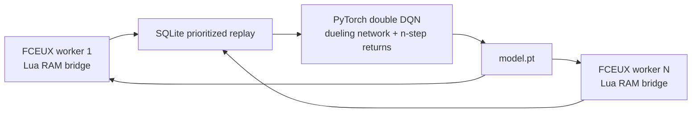

# Python Rainbow training for FCEUX

This is the high-throughput training path. FCEUX still emulates SMB1 and the
Lua bridge reads RAM and presses buttons. Python owns the actual ML system:



## Why this replaces training-only Lua

The existing Lua NEAT script remains useful for FCEUX-only play, inspecting
networks, and a neuroevolution baseline. The Python path removes the main
training bottleneck: one Lua population member plays at a time. It can launch
multiple independent FCEUX workers and train one shared model from every
transition. A successful jump or death can update the replay learner without
waiting for a full 100-genome NEAT generation.

The learner implements a focused Rainbow-style DQN combination:

- Double DQN target selection to reduce action-value overestimation.
- Dueling value/advantage heads so the model can separately learn state value
  and the advantage of each of the six controller actions.
- Persistent prioritized replay in `replay.sqlite3`, so high-TD-error events
  such as a pipe collision or successful jump are replayed more often.
- Three-step returns, which move outcome feedback backward across short action
  sequences.
- A `model.pt` checkpoint containing the PyTorch network, target network,
  optimizer state, and exploration progress.

This is not a claim that it is already faster than every Mario project. That
requires the benchmark below. Its architecture removes known serial-training
limits and enables a fair comparison.

## Requirements

- A compatible FCEUX build with Lua support. FCEUX documents the `-lua` and
  `-nothrottle` command-line options.
- A legally obtained SMB1 ROM, supplied locally through `--rom`; the project
  never stores or distributes a ROM.
- Python 3.10+ with NumPy and a suitable PyTorch build. Apple Silicon uses
  `mps` when available; NVIDIA systems use `cuda`; otherwise CPU is used.

Install Python dependencies in your chosen virtual environment:

```sh
python3 -m pip install -r python/requirements.txt
```

## Run training

Start FCEUX workers from the project root. The first time, each worker opens at
the SMB1 title screen. Start World 1-1 manually in each window once. The bridge
captures a fixed state only when Mario is near the start, then all future
episode resets restore that state. It never presses Start.

```sh
PYTHONPATH=python python3 -m mario_ai_fceux.train \
  --rom /absolute/path/to/SuperMarioBros.nes \
  --fceux fceux \
  --workers 4 \
  --run-dir runs/world-1-1-rainbow
```

Resume exactly the saved model and replay database:

```sh
PYTHONPATH=python python3 -m mario_ai_fceux.train \
  --rom /absolute/path/to/SuperMarioBros.nes \
  --fceux fceux \
  --workers 4 \
  --run-dir runs/world-1-1-rainbow --resume
```

### World curriculum

The supplied SMB1 disassembly exposes the title-screen world selector. Pass one
world number per worker to train a shared model across the first level of
several worlds:

```bash
PYTHONPATH=python .venv-fceux/bin/python -m mario_ai_fceux.train \
  --rom SuperMarioBros.nes --fceux fceux --workers 8 \
  --worlds 1,1,2,2,4,4,8,8 --run-dir runs/world-1-1-rainbow --resume
```

This starts workers in **1-1, 2-1, 4-1, and 8-1**. SMB1's selector starts a
world at level 1; later courses such as 1-2 or 4-3 require verified FCEUX
course-start states. The bridge records world, level, and area values in the
model observation so a shared network can distinguish the assigned courses.

`Ctrl+C` writes `model.pt` before processes are closed. Do not run the Python
trainer and `mario_ai_neat.lua` in the same FCEUX worker: they both control
port 1.

## Benchmark it honestly

Compare this path with the Lua NEAT trainer using the same ROM, same World 1-1
start, same machine, and separately measured clean-start champion runs. Record:

| Metric | Why it matters |
| --- | --- |
| Environment decisions and frames | Independent of worker count |
| Wall-clock time | Measures actual throughput |
| Best world X at fixed frame budgets | Measures early learning |
| Clean-start completion rate | Measures reliable play, not training-state overfit |
| Number of FCEUX workers and device | Makes hardware advantage visible |

The current bridge sends the same 13×13 tile/enemy grid plus 15 SMB1 RAM
features used by the Lua AI. The next research step is an offline sequence model
only after `replay.sqlite3` contains enough successful, diverse trajectories.
Adding a Transformer before that would train it mostly on failures.
