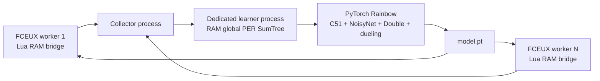

# Python Rainbow training for FCEUX

This is the high-throughput training path. FCEUX still emulates SMB1 and the
Lua bridge reads RAM and presses buttons. Python owns the actual ML system:



## Why this replaces training-only Lua

The existing Lua NEAT script remains useful for FCEUX-only play, inspecting
networks, and a neuroevolution baseline. The Python path removes the main
training bottleneck: one Lua population member plays at a time. It can launch
multiple independent FCEUX workers and train one shared model from every
transition. A successful jump or death can update the replay learner without
waiting for a full 100-genome NEAT generation.

The learner implements the complete Rainbow DQN combination:

- Double DQN target selection to reduce action-value overestimation.
- Dueling value/advantage heads so the model can separately learn state value
  and the advantage of each of the six controller actions.
- C51 distributional values: each action predicts a 51-atom return
  distribution instead of only one expected value.
- NoisyNet layers for learned exploration, so training does not depend on a
  hand-written Mario action prior or epsilon-greedy random movement.
- Exact global proportional prioritized replay through an in-memory SumTree.
  It has no `ORDER BY RANDOM()` query and no per-transition SQLite commit.
- Three-step returns, which move outcome feedback backward across short action
  sequences.
- A `model.pt` checkpoint containing the PyTorch network, target network,
  optimizer, configuration, and Python/NumPy/PyTorch RNG state, plus a
  `replay.npz` snapshot containing the full replay and its sampling RNG state.

This is not a claim that it is already faster than every Mario project. That
requires the benchmark below. Its architecture removes known serial-training
limits and enables a fair comparison.

## Requirements

- A compatible FCEUX build with Lua support. FCEUX documents the `-lua` and
  `-nothrottle` command-line options.
- A legally obtained SMB1 ROM, supplied locally through `--rom`; the project
  never stores or distributes a ROM.
- Python 3.10+ with NumPy and a suitable PyTorch build. Apple Silicon uses
  `mps` when available; NVIDIA systems use `cuda`; otherwise CPU is used.

Install Python dependencies in your chosen virtual environment:

```sh
python3 -m pip install -r python/requirements.txt
```

## Run training

Start FCEUX workers from the project root. On first launch, the bridge uses the
verified SMB1 title-screen world selector, starts its assigned world once, and
captures a fixed state near the course start. Every later training reset
restores that state. It never presses Start after a death or game-over screen.

```sh
PYTHONPATH=python python3 -m mario_ai_fceux.apex_train \
  --rom /absolute/path/to/SuperMarioBros.nes \
  --fceux fceux \
  --workers 8 \
  --worlds 1,2,3,4,5,6,7,8 \
  --run-dir runs/full-rainbow
```

Resume from the latest paired model and replay checkpoint:

```sh
PYTHONPATH=python python3 -m mario_ai_fceux.apex_train \
  --rom /absolute/path/to/SuperMarioBros.nes \
  --fceux fceux \
  --workers 8 \
  --worlds 1,2,3,4,5,6,7,8 \
  --run-dir runs/full-rainbow --resume
```

### World curriculum

The supplied SMB1 disassembly exposes the title-screen world selector. Pass one
world number per worker to train a shared model across the first level of
several worlds:

```bash
PYTHONPATH=python .venv-fceux/bin/python -m mario_ai_fceux.apex_train \
  --rom SuperMarioBros.nes --fceux fceux --workers 8 \
  --worlds 1,2,3,4,5,6,7,8 --run-dir runs/full-rainbow --resume
```

This starts one worker in every first course: **1-1 through 8-1**. SMB1's
selector starts a world at level 1; later courses such as 1-2 or 4-3 require
verified FCEUX course-start states. The bridge records world, level, and area
values in the model observation so a shared network can distinguish courses.

### Checkpoints and storage

`model.pt` and `replay.npz` are written every 10,000 learner updates and when
training stops. Replay stays in memory during learning; actors send bounded
batches and wait when the learner queue is full, so transitions are not
dropped. The replay snapshot stores every transition, global sum/min priority
trees, and its sampling RNG state. The model checkpoint stores the model,
target network, optimizer, Python/NumPy/PyTorch RNG state, learner counters,
determinism setting, and the replay snapshot ID. The prior model/replay pair is
kept as `.bak`; resume validates IDs and falls back to that pair if the latest
pair was interrupted or corrupted. Seeds and run conditions are in `run.json`.
Asynchronous worker arrival order means resumed runs are seeded but not
bit-for-bit deterministic. Live checkpoints stay out of Git.

`Ctrl+C` writes `model.pt` before processes are closed. Do not run the Python
trainer and `mario_ai_neat.lua` in the same FCEUX worker: they both control
port 1.

This is full Rainbow as implemented here: C51 distributional values, NoisyNet,
Double DQN, dueling heads, n-step returns, and proportional PER with a global
SumTree and global minimum-probability importance-weight normalization. The
eight actors send bounded batches; the learner applies backpressure rather
than losing transitions when it falls behind. The default queue holds 512
batches to limit memory use.

### Automatic health report

The active Python trainer writes a health report when it starts and then every
**10 minutes**. It verifies that every worker is still publishing observations,
checks free disk space, and records whether the Lua NEAT log is fresh. Read the
latest snapshot at:

```text
runs/full-rainbow/health/latest.json
```

`repair_required` is empty when the Python worker observations are healthy.
If it lists a stale worker, inspect that FCEUX window before restarting the
trainer. The trainer creates the report at startup and refreshes it every ten minutes;
checks remain tied to the actual worker and learner state.

At the same time it writes a concise comparison table to:

```text
runs/full-rainbow/health/learning_report.md
```

The table compares Python decisions, optimizer updates, replay size, reward
progress, and victories with Lua NEAT generation, record fitness, and latest
distance. It reports a discovery only for a measured new record or victory.

Run `scripts/health_check.py` manually to write `cron_latest.json` and
`cron_report.md` immediately. On macOS, cron may lack privacy permission to read
a checkout under `Documents`; the trainer's own ten-minute report loop remains
the authoritative monitor in that case.

## Evaluation and comparable benchmarks

Training metrics are never treated as evaluation. Use the greedy evaluator,
which disables NoisyNet exploration and never sends training transitions:

```bash
PYTHONPATH=python .venv-fceux/bin/python -m mario_ai_fceux.evaluate \
  --rom SuperMarioBros.nes --fceux fceux --run-dir runs/full-rainbow \
  --world 1 --episodes 10 --evaluation-seed 2026
```

It writes a timestamped `results.json` and `episodes.csv`. The benchmark tool
rejects reports with different ROM hashes, FCEUX executable hashes, worlds,
start protocols, action repeats, evaluation seeds, or episode counts. It also
rejects incomplete, non-finite, or inconsistent episode metrics. Python reports
declare the same SMB1 title-screen world-selection and FCEUX savestate-slot-10
start protocol. The output table shows wins, completion rate, mean/best X,
action decisions, and seconds. Produce compatible results for Lua NEAT Champion,
basic DDQN, PPO, and Rainbow from the same conditions. Then create one
comparison table:

```bash
PYTHONPATH=python .venv-fceux/bin/python -m mario_ai_fceux.benchmark \
  --result 'Lua NEAT=neat-results.json' --result 'Basic DDQN=ddqn-results.json' \
  --result 'PPO=ppo-results.json' --result 'Rainbow=runs/full-rainbow/evaluations/.../results.json' \
  --output benchmark.md
```

## Benchmark it honestly

Compare this path with the Lua NEAT trainer using the same ROM, same World 1-1
start, same machine, and separately measured clean-start champion runs. Record:

| Metric | Why it matters |
| --- | --- |
| Environment decisions and frames | Independent of worker count |
| Wall-clock time | Measures actual throughput |
| Best world X at fixed frame budgets | Measures early learning |
| Clean-start completion rate | Measures reliable play, not training-state overfit |
| Number of FCEUX workers and device | Makes hardware advantage visible |

The current bridge sends the same 13×13 tile/enemy grid plus 15 SMB1 RAM
features used by the Lua AI. The next research step is an offline sequence model
only after `replay.sqlite3` contains enough successful, diverse trajectories.
Adding a Transformer before that would train it mostly on failures.
