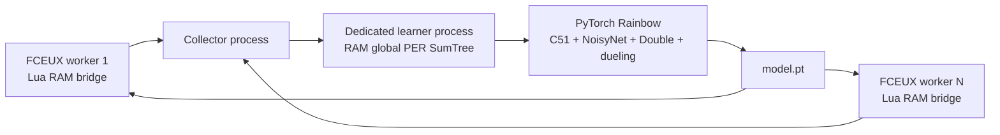

# Python Rainbow training for FCEUX

This is the high-throughput training path. FCEUX still emulates SMB1 and the
Lua bridge reads RAM and presses buttons. Python owns the actual ML system:



## Why this replaces training-only Lua

The existing Lua NEAT script remains useful for FCEUX-only play, inspecting
networks, and a neuroevolution baseline. The Python path removes the main
training bottleneck: one Lua population member plays at a time. It can launch
multiple independent FCEUX workers and train one shared model from every
transition. A successful jump or death can update the replay learner without
waiting for a full 100-genome NEAT generation.

The learner implements the complete Rainbow DQN combination:

- Double DQN target selection to reduce action-value overestimation.
- Dueling value/advantage heads so the model can separately learn state value
  and the advantage of each movement-and-duration choice: walk, run, jump-run,
  retreat, brake, jump in place, or jump backward, held for 6, 12, or 24 frames.
- C51 distributional values: each action predicts a 51-atom return
  distribution instead of only one expected value.
- NoisyNet layers remain active in the learner's Rainbow updates. Actor action
  selection is pure Ape-X epsilon-greedy: actors run in evaluation mode, so
  NoisyLinear uses its learned mean weights.
- Exact global proportional prioritized replay through an in-memory SumTree.
  It has no `ORDER BY RANDOM()` query and no per-transition SQLite commit.
- Three-step returns, which move outcome feedback backward across short action
  sequences. Discounts are adjusted to each action's frame duration.
- A `model.pt` checkpoint containing the PyTorch network, target network,
  optimizer, configuration, and Python/NumPy/PyTorch RNG state, plus a
  `replay.npz` snapshot containing the full replay and its sampling RNG state.

This is not a claim that it is already faster than every Mario project. That
requires the benchmark below. Its architecture removes known serial-training
limits and enables a fair comparison.

## Requirements

- A compatible FCEUX build with Lua support. FCEUX documents the `-lua` and
  `-nothrottle` command-line options.
- A legally obtained SMB1 ROM, supplied locally through `--rom`; the project
  never stores or distributes a ROM.
- Python 3.10+ with NumPy and a suitable PyTorch build. Apple Silicon uses
  `mps` when available; NVIDIA systems use `cuda`; otherwise CPU is used.

Install Python dependencies in your chosen virtual environment:

```sh
python3 -m pip install -r python/requirements.txt
```

## Run training

Start FCEUX workers from the project root. On first launch, the bridge uses the
verified SMB1 title-screen world selector, starts its assigned world once, and
captures both a current-level state and that world's level-1 state. Deaths and
stalls retry the current level. A verified flagpole win progresses through the
world naturally; after level 4, the worker restores its saved level-1 state.
It never presses Start after a death or game-over screen.

```sh
PYTHONPATH=python python3 -m mario_ai_fceux.apex_train \
  --rom /absolute/path/to/SuperMarioBros.nes \
  --fceux fceux \
  --workers 8 \
  --worlds 1,2,3,4,5,6,7,8 \
  --run-dir runs/full-rainbow
```

Resume from the latest paired model and replay checkpoint:

```sh
PYTHONPATH=python python3 -m mario_ai_fceux.apex_train \
  --rom /absolute/path/to/SuperMarioBros.nes \
  --fceux fceux \
  --workers 8 \
  --worlds 1,2,3,4,5,6,7,8 \
  --run-dir runs/full-rainbow --resume --queue-capacity 10000
```

### World campaign cycle

The supplied SMB1 disassembly exposes the title-screen world selector. Pass one
world number per worker to train one shared model across eight repeating,
independent world campaigns:

```bash
PYTHONPATH=python .venv-fceux/bin/python -m mario_ai_fceux.apex_train \
  --rom SuperMarioBros.nes --fceux fceux --workers 8 \
  --worlds 1,2,3,4,5,6,7,8 --run-dir runs/full-rainbow --resume
```

| Worker | Repeating campaign |
| --- | --- |
| 0 | 1-1 → 1-2 → 1-3 → 1-4 → 1-1 |
| 1 | 2-1 → 2-2 → 2-3 → 2-4 → 2-1 |
| 2 | 3-1 → 3-2 → 3-3 → 3-4 → 3-1 |
| 3 | 4-1 → 4-2 → 4-3 → 4-4 → 4-1 |
| 4 | 5-1 → 5-2 → 5-3 → 5-4 → 5-1 |
| 5 | 6-1 → 6-2 → 6-3 → 6-4 → 6-1 |
| 6 | 7-1 → 7-2 → 7-3 → 7-4 → 7-1 |
| 7 | 8-1 → 8-2 → 8-3 → 8-4 → 8-1 |

The bridge saves the level-start checkpoint only after Mario is stable at the
new level's start. The shared network receives world, level, and area values in
its observation, so it can distinguish the 32 SMB1 courses. A worker restart
begins its campaign from that worker's World-N-1; model and replay checkpoints
remain reusable across restarts.

### Faster learning and retaining wins

The eight-world assignment maximizes course coverage, but gives each course
only one exploration stream. For a fresh model, a one-hour trial can instead
assign several workers to early courses, for example
`--worlds 1,1,1,1,2,2,3,4`. Once clean, greedy evaluation repeatedly completes
those courses, expand the assignment toward `1,2,3,4,5,6,7,8`. This is a
curriculum hypothesis, not a measured speedup for this ROM. Keep the two trials
in separate run directories and compare victories and greedy progress after
the same number of environment transitions as well as the same wall time.

Every actor now explores an unsolved level with at least 10% random actions.
After that actor wins the level, its original Ape-X epsilon applies. The floor
can be changed with `--unsolved-epsilon-floor`; `0.003` reproduces the old
effective eight-actor schedule. This matters most for late workers: the old
World 8 actor used only 0.3% random actions, despite training on a different
course from every other worker.

When a worker wins, it sends up to the last 8,192 n-step episode transitions to a bounded
protected part of the shared replay (up to 10,000 transitions, or 5% of a
smaller buffer). Normal replay turnover cannot overwrite these transitions.
Protected positions and their order are saved in `replay.npz`; resume of an
older snapshot also protects surviving positive terminal transitions. The
archive can still replace its oldest successful transitions when full, and
rehearsal reduces forgetting rather than guaranteeing perfect play. The
learner reports `protected_success_transitions` so retention is visible.

Actors also use a bounded frontier curriculum. After Mario reaches another
256 pixels on stable ground, the bridge saves an in-memory FCEUX savestate.
After a death or four-second no-progress cutoff, the actor retries that
frontier up to three times; then it returns to the clean level start. This
concentrates attempts on the next obstacle without creating an irreversible
shortcut: a frontier is never reused across levels or worker restarts, and
only fully verified wins are kept in protected replay. Change the settings
with `--frontier-spacing` and `--frontier-retries` (set retries to `0` to
disable frontier restoration). This is inspired by Go-Explore's return-and-
explore idea, adapted to FCEUX's local savestates rather than a claim of exact
Go-Explore reproduction.

The automatic greedy evaluator now discards batches if its emulator stops
publishing observations. Its best-policy archive ranks completed episode
progress from the actual records and keeps the strongest measured weights
separately from the latest training checkpoint. A valid greedy run with
actions and repeated wins is the evidence that a skill transferred; training
reward or a single powered-worker win is insufficient.

These choices follow the [Ape-X actor diversity study](https://openreview.net/pdf?id=H1Dy---0Z),
[Rainbow's component study](https://ojs.aaai.org/index.php/AAAI/article/view/11796),
[curriculum learning survey](https://www.jmlr.org/papers/v21/20-212.html), and
[experience replay for continual learning](https://proceedings.neurips.cc/paper/8327-experience-replay-for-continual-learning.pdf).

### Alternating powered and normal campaigns

With `--cheats-enabled-workers 0,1,2,3 --alternate-cheat-campaigns`, workers
0–3 begin powered. After each completes all four levels in its world, FCEUX
restarts only that worker with cheats disabled for the next four-level campaign.
After the normal campaign completes, it restarts powered again. Workers 4–7 and
the greedy evaluator remain normal Mario throughout. FCEUX reloads its private
cheat configuration on this controlled restart; the bridge does not pretend to
toggle power by writing RAM.

The default eight-worker launch reads `cheats=enabled/disabled` from
`config/fceux-window-layout.ini`: workers 0–3 are powered and 4–7 are normal.
`--cheats-enabled-workers` overrides those entries. Enabled workers receive
the same checked-in `config/SuperMarioBros.cht`, so a fresh run does not depend
on different local cheat files from previous emulator sessions. The evaluator
always runs without cheats.

### World 1 mastery bootcamp

For the fastest clean-policy recovery, run all eight actors on World 1 with
the saved window geometry but no cheats, and repeat level 1-1 after each win:

```bash
PYTHONPATH=python .venv-fceux/bin/python -m mario_ai_fceux.apex_train \
  --rom SuperMarioBros.nes --fceux fceux --workers 8 --worlds 1,1,1,1,1,1,1,1 \
  --run-dir runs/w1-bootcamp --resume --cheats-enabled-workers '' \
  --repeat-level-on-victory
```

Do not promote a level merely because a training actor has one lucky win.
Promote only after greedy no-cheat evaluation wins at least 16 of 20 episodes;
then retain two workers on the mastered course and move six to the next course.

### Checkpoints and storage

`model.pt` and `replay.npz` are written every 10,000 learner updates and when
training stops. Replay stays in memory during learning; actors send bounded
batches and wait when the learner queue is full, so transitions are not
dropped. The replay snapshot stores every transition, global sum/min priority
trees, and its sampling RNG state. The model checkpoint stores the model,
target network, optimizer, Python/NumPy/PyTorch RNG state, learner counters,
determinism setting, and the replay snapshot ID. The prior model/replay pair is
kept as `.bak`; resume validates IDs and falls back to that pair if the latest
pair was interrupted or corrupted. Seeds and run conditions are in `run.json`.
Asynchronous worker arrival order means resumed runs are seeded but not
bit-for-bit deterministic. The published checkpoint pair is stored in
`runs/full-rainbow/model.pt` and `runs/full-rainbow/replay.npz`; commit or push
both files together after a clean checkpoint. A live run may advance the local
pair beyond the latest published snapshot.

`Ctrl+C` writes `model.pt` before processes are closed. Do not run the Python
trainer and `mario_ai_neat.lua` in the same FCEUX worker: they both control
port 1.

This is Rainbow with C51 distributional values, learner-side NoisyNet, Double
DQN, dueling heads, n-step returns, and proportional PER with a global SumTree
and global minimum-probability importance-weight normalization. Actors use
pure epsilon-greedy selection. The eight actors send bounded 32-transition
batches through a 10,000-batch queue; the learner applies backpressure rather
than losing transitions when it falls behind.

### Automatic health report

The active Python trainer writes a health report when it starts and then every
**10 minutes**. It verifies that every worker is still publishing observations,
checks free disk space, and records whether the Lua NEAT log is fresh. Read the
latest snapshot at:

```text
runs/full-rainbow/health/latest.json
```

`repair_required` is empty when the Python worker observations are healthy.
If it lists a stale worker, inspect that FCEUX window before restarting the
trainer. The trainer creates the report at startup and refreshes it every ten minutes;
checks remain tied to the actual worker and learner state.

At the same time it writes a concise comparison table to:

```text
runs/full-rainbow/health/learning_report.md
```

The table compares Python decisions, optimizer updates, replay size, reward
progress, and victories with Lua NEAT generation, record fitness, and latest
distance. It reports a discovery only for a measured new record or victory.

Run `scripts/health_check.py` manually to write `cron_latest.json` and
`cron_report.md` immediately. On macOS, cron may lack privacy permission to read
a checkout under `Documents`; the trainer's own ten-minute report loop remains
the authoritative monitor in that case.

## Evaluation and comparable benchmarks

Training metrics are never treated as evaluation. Use the greedy evaluator,
which disables NoisyNet exploration and never sends training transitions:

```bash
PYTHONPATH=python .venv-fceux/bin/python -m mario_ai_fceux.evaluate \
  --rom SuperMarioBros.nes --fceux fceux --run-dir runs/full-rainbow \
  --world 1 --episodes 10 --evaluation-seed 2026
```

It writes a timestamped `results.json` and `episodes.csv`. The benchmark tool
rejects reports with different ROM hashes, FCEUX executable hashes, worlds,
start protocols, action repeats, evaluation seeds, or episode counts. It also
rejects incomplete, non-finite, or inconsistent episode metrics. Python reports
declare the same SMB1 title-screen world-selection and FCEUX savestate-slot-10
start protocol. The output table shows wins, completion rate, mean/best X,
action decisions, and seconds. Produce compatible results for Lua NEAT Champion,
basic DDQN, PPO, and Rainbow from the same conditions. Then create one
comparison table:

```bash
PYTHONPATH=python .venv-fceux/bin/python -m mario_ai_fceux.benchmark \
  --result 'Lua NEAT=neat-results.json' --result 'Basic DDQN=ddqn-results.json' \
  --result 'PPO=ppo-results.json' --result 'Rainbow=runs/full-rainbow/evaluations/.../results.json' \
  --output benchmark.md
```

The evaluator accepts Rainbow, basic DDQN, and PPO checkpoints. Train either
baseline through the same FCEUX bridge using its legacy six-action, 12-frame
profile, then evaluate its `model.pt` with the same command. Rainbow uses the
separate 21-choice variable-duration profile:

```bash
PYTHONPATH=python .venv-fceux/bin/python -m mario_ai_fceux.baseline_train \
  --algorithm ddqn --rom SuperMarioBros.nes --fceux fceux \
  --workers 1 --worlds 1 --steps 100000 --run-dir runs/ddqn
PYTHONPATH=python .venv-fceux/bin/python -m mario_ai_fceux.evaluate \
  --rom SuperMarioBros.nes --fceux fceux --run-dir runs/ddqn \
  --world 1 --episodes 10 --evaluation-seed 2026
```

Replace `ddqn` with `ppo` for PPO. DDQN is Double DQN with a uniform bounded
RAM replay deque and target network; it deliberately has no C51, NoisyNet,
dueling head, or prioritized replay. PPO is clipped categorical policy
optimization with worker-local GAE rollouts. Its updates wait until all workers
finish an episode, then hold each emulator at the exact clean start while the
policy updates. Use one worker for controlled policy comparisons; use the same
worker count and transition budget when comparing training throughput.

To benchmark the Lua NEAT Champion, reload `mario_ai_neat.lua` with
`PLAY_CHAMPION_ONLY = true`. Champion now saves the first valid selected-world
course start and restores it after each terminal episode. It uses the same
1/2/4/6-frame action holds and logs world, level, decision count, and duration.
After at least ten completed attempts, convert the latest Champion run:

```bash
PYTHONPATH=python .venv-fceux/bin/python -m mario_ai_fceux.import_lua_evaluation \
  --log mario_ai_neat.log --database mario_ai_neat.db \
  --rom SuperMarioBros.nes --fceux fceux --world 1 --level 1 \
  --episodes 10 --evaluation-seed 2026 --output runs/lua-neat/results.json
```

The importer rejects logs without a Champion session or ten matching complete
episodes. Generate the final table only when every result has the same ROM,
FCEUX binary, world/level, clean-start protocol, action repeat, seed, and episode
count. Training, evaluation, and benchmarking remain distinct; no performance
claim is made until these measured reports exist.

The periodic Ape-X evaluator also writes benchmark-ready JSON and episode CSV
files under `runs/full-rainbow/evaluations/eval-XXXXXX/`. Its JSON records the
frozen evaluation policy, episode outcomes, and run metadata. Use a report only
when the other policies were evaluated with the same conditions above.

## Benchmark it honestly

Compare this path with the Lua NEAT trainer using the same ROM, same World 1-1
start, same machine, and separately measured clean-start champion runs. Record:

| Metric | Why it matters |
| --- | --- |
| Environment decisions and frames | Independent of worker count |
| Wall-clock time | Measures actual throughput |
| Best world X at fixed frame budgets | Measures early learning |
| Clean-start completion rate | Measures reliable play, not training-state overfit |
| Number of FCEUX workers and device | Makes hardware advantage visible |

The current bridge sends the same 13×13 tile/enemy grid plus 15 SMB1 RAM
features used by the Lua AI. The next research step is an offline sequence model
only after `replay.sqlite3` contains enough successful, diverse trajectories.
Adding a Transformer before that would train it mostly on failures.
