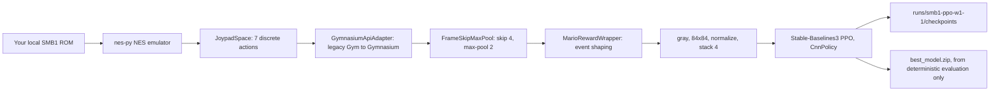

# SMB1 PPO baseline

A separate, Python-only PPO trainer for **original NES Super Mario Bros. 1**, built
as an experiment and a benchmark against the existing Ape-X Rainbow system. The
first target is reliable no-cheat completion of World 1-1.

Nothing here modifies the Rainbow trainer, its checkpoints, the Lua NEAT script,
or the FCEUX bridge. It is a different environment, a different observation
format, and a different algorithm.

## Why this is separate from Rainbow

| | Ape-X Rainbow (existing) | SMB1 PPO (this) |
|---|---|---|
| Environment | FCEUX + Lua RAM bridge | `gym-super-mario-bros` + `nes-py` |
| Observation | RAM-derived feature vector | 4 stacked 84x84 grayscale frames |
| Actions | 7 bases x 3 durations = 21 macros | 7 flat buttons, no macro durations |
| Algorithm | Distributed Ape-X Rainbow (C51 + NoisyNet + Double + dueling) | Stable-Baselines3 PPO |
| Learning signal | Prioritized replay from many actors | On-policy rollouts from vectorized envs |
| Evaluation | FCEUX window driven by the bridge | Headless, on demand, no emulator window |

A Rainbow `model.pt` cannot be loaded here. Its weights describe a different
observation tensor, a different action space, and a different architecture, so
there is no meaningful transfer; the value is in comparing two independent
approaches on the same level under the same no-cheat rule.



## The ROM is yours, and the trainer checks it

No ROM is included, downloaded, or redistributed by this repository. Import a
legally obtained cartridge dump once (this works on either environment layout):

```bash
python -m smb1_ppo.rom import --source "/path/to/Super Mario Bros. (World).nes"
```

That writes `roms/super-mario-bros.nes` plus a `rom-import.json` sidecar holding
the checksums, header fields, and import time. `*.nes` is already gitignored.

The importer refuses images whose SHA-256 is not a known Super Mario Bros.
(World) dump unless you pass `--allow-unverified`, because a run against an
unidentified image produces unverifiable measurements. Structural checks always
apply: iNES magic, mapper 0 (NROM), 32 KiB PRG, 8 KiB CHR, no trainer, NTSC.

Every run and every evaluation records the image it used:

```bash
python -m smb1_ppo.rom check          # inspect the configured ROM without copying
```

## Environment compatibility

There are two incompatible `gym-super-mario-bros` layouts, and this package runs
on either. Which one you get is decided by your Python version, and the install
script picks the matching dependency file.

| | Modern (recommended) | Legacy |
|---|---|---|
| Python | 3.13 or 3.14 | 3.12 |
| `gym-super-mario-bros` | 9.x | 7.4.0 |
| `nes-py` | 9.x | 8.2.1 |
| API | Gymnasium-native: tuple reset, five-tuple step, `gymnasium` spaces | legacy Gym: bare-array reset, four-tuple step, `gym.spaces` |
| Wheels | prebuilt for Linux, macOS, and Windows | source build only (**MSVC Build Tools 2022 required on Windows**, clang++ or g++ elsewhere) |
| NumPy | 2 supported | must be `< 2` |
| ROM lookup | `smb1_rom_path()` | `rom_path(lost_levels, rom_mode)` |
| Pit detection | `info["y_viewport"]` is public | RAM byte `0x00B5` is probed through the adapter |

Prefer the modern layout, especially on Windows: needing a C++ toolchain just to
install an emulator is the most likely way a first run stalls.

`smb1_ppo.compat` is the single place that knows about the difference. On the
legacy layout it translates `reset`/`step` arity and converts `gym.spaces` into
`gymnasium.spaces`, and it passes only the reset and render arguments each
wrapped environment actually accepts — `nes_py`'s `JoypadSpace` overrides
`reset` with no parameters at all, so it silently swallows a seed, and the
legacy `render` takes a `mode` argument where the Gymnasium one takes none. On
the modern layout those translations are pass-throughs.

`smb1_ppo.rom.use_local_rom` redirects whichever lookup the installed release
calls, and refuses Lost Levels and the ROM-hack image variants on both, because
those change the pixels the CNN sees and would silently invalidate a comparison
against Rainbow.

Both layouts are verified here: the full suite passes on each, and each ran a
bounded real-ROM training and evaluation smoke test. `run.json` records the
versions and the ROM lookup seam a run used, so a result states which layout
produced it.

## Action mapping

Seven discrete actions, flat. There are no duration variants: frame skip and the
CNN policy resolve timing themselves, which is exactly the design choice that
makes PPO viable where the Rainbow system needed 21 macro actions.

| Index | Name | Buttons |
|---|---|---|
| 0 | `NOOP` | none |
| 1 | `right` | right |
| 2 | `right+A` | right, A (jump) |
| 3 | `right+B` | right, B (run) |
| 4 | `right+A+B` | right, A, B (running jump) |
| 5 | `left` | left |
| 6 | `left+A` | left, A |

Action indices are part of the checkpoint contract; `smb1_ppo/actions.py` must
never be reordered, and the tests assert the exact table and that nes-py accepts
every button name. No action presses left and right together.

## Reward design

Every term comes from a signal the environment actually reports:

| Signal | Source | Use |
|---|---|---|
| `x_pos` | `info["x_pos"]` | forward progress |
| `status` | `info["status"]`: `small`, `tall`, `fireball` | power-ups and power loss |
| `life` | `info["life"]` | losing a life |
| `time` | `info["time"]` | in-game time-out |
| `flag_get` | `info["flag_get"]` | level completion |
| viewport | RAM `0x00B5`, the byte upstream uses | telling a pit fall from a hazard |

| Term | Default | Meaning |
|---|---|---|
| flag capture | `+50` | verified completion; the largest single reward |
| fire flower | `+15` | `status` rises to `fireball` |
| mushroom | `+8` | `status` rises to `tall` |
| death | `-15` | the episode ended without a flag, or a life was lost |
| time-out | `-15` | `info["time"]` reached 0 |
| power loss | `-8` | `status` fell, except when the fall is part of a death |
| forward | `+0.01` per world pixel | capped at `0.25` per step and `30` per episode |
| time cost | `-0.02` per decision | makes stalling strictly unprofitable |

Each power-up is a one-time event: the reward fires on the transition, so a
mushroom collected once pays once. The environment's own reward is preserved
unchanged in `info["raw_reward"]` on every step, beside `info["shaped_reward"]`
and the full `info["reward_terms"]` breakdown, and both are written to
TensorBoard.

### Anti-reward-hacking safeguards

- **Forward progress pays only for new ground.** The reward is computed against
  the furthest x reached in the episode, so walking backwards, oscillating over
  ground already covered, and re-crossing a section all earn exactly zero.
- **Total forward shaping is capped per episode**, so no amount of small jitter
  can out-earn finishing the level.
- **Standing still is never free.** The per-decision time cost applies whether
  or not Mario moves.
- **No coin, score, or enemy reward at all.** Coin and score farming is the
  classic SMB1 exploit, and nothing here pays for it.
- **Death is charged once.** A death that also drops Mario's power level is not
  billed twice.
- **Termination is truncated, not fatal, when it is not a death.** A step-limit
  cut-off carries no death penalty, so the value function bootstraps instead of
  learning that long episodes are dangerous.
- **Nothing is invented.** A missing signal turns its component off (it
  contributes exactly `0.0`) and is reported through `wrapper.signals.missing`
  and into `run.json`, rather than being replaced by a proxy.

### What is deliberately not rewarded

The installed environment does not expose which hazard killed Mario, whether a
star granted invincibility, or which item was collected beyond the status byte.
Death cause is therefore reported as `pit` (viewport above 1), `hazard` (any
other death that is not a time-out), or `unclassified` (no viewport probe), and
no reward depends on the distinction. No fake item signal is derived from the
score counter.

## Commands

Install (creates `.venv`, picks the dependency set for your Python version, and
prints which layout it installed):

```bash
scripts/smb1_ppo_setup.sh
```

It needs Python 3.12 or 3.13+. Anything older is refused with a clear message
rather than a dependency-resolution failure. The two dependency files are
`requirements-smb1-ppo.txt` (Python 3.13+) and `requirements-smb1-ppo-py312.txt`.

Import a ROM you own:

```bash
python -m smb1_ppo.rom import --source "/path/to/Super Mario Bros. (World).nes"
```

Train fresh on World 1-1, 8 parallel environments:

```bash
python -m smb1_ppo.train --rom roms/super-mario-bros.nes \
    --world 1 --stage 1 --workers 8 --total-timesteps 2000000
```

Resume the most recent checkpoint:

```bash
python -m smb1_ppo.train --rom roms/super-mario-bros.nes \
    --workers 8 --total-timesteps 4000000 --resume latest
```

Evaluate 20 deterministic no-cheat World 1-1 episodes:

```bash
python -m smb1_ppo.evaluate --model runs/smb1-ppo-w1-1/best_model.zip --episodes 20
```

Watch one rendered episode (needs a desktop session; never runs automatically):

```bash
python -m smb1_ppo.watch --model runs/smb1-ppo-w1-1/best_model.zip
```

Run the checks (no ROM required):

```bash
tests/smb1_ppo/run.sh
```

Training accepts `--env synthetic` to exercise the entire pipeline without a
ROM. The synthetic stand-in reports the same observation, `info`, and reward
contract, and it can never be promoted as a World 1-1 result.

### Useful trainer flags

`--workers` (default 8), `--n-steps`, `--batch-size`, `--n-epochs`,
`--learning-rate`, `--features-dim`, `--device auto|cpu|cuda|mps`,
`--checkpoint-freq`, `--keep-checkpoints`, `--eval-freq`, `--eval-episodes`,
`--no-eval`, `--resume latest|best|<path>`, `--frame-skip`, `--frame-size`,
`--frame-stack`, `--max-episode-steps`, `--no-progress-frames`, and every reward
weight as `--forward-scale`, `--flag-reward`, and so on.

## Output layout

Everything lands in `runs/smb1-ppo-w1-1/`:

```
run.json                      full config, ROM fingerprints, library versions
training_state.json           resume cursor
checkpoints/latest.zip        always the newest checkpoint
checkpoints/checkpoint_*_steps.zip   plus a .json sidecar with checksum and config
best_model.zip                only ever written by a deterministic evaluation
best_model_eval.json          the measurement that earned it
tensorboard/                  SB3 logs plus reward_terms/, episodes/, rollout/
evaluations/<timestamp>/      results.json, episodes.csv, action_trace.csv, .jsonl
```

The trainer refuses to write into `runs/w1-bootcamp`, `runs/full-rainbow`, or
`runs/full-rainbow-input-fixed`, so a PPO experiment cannot disturb the Rainbow
run that owns them.

`best_model.zip` is replaced only when a *deterministic* evaluation ranks higher
than the recorded best, with win rate first and mean furthest-x second. Nothing
else can promote a model.

## Hardware expectations

One `nes-py` process per worker; each worker is CPU-bound and single-threaded,
so workers should not exceed physical cores.

- **Windows or Apple Silicon with Python 3.13+, 8 workers:** the intended
  configuration. On Windows this also avoids needing MSVC Build Tools, which the
  legacy `nes-py 8.2.1` source build requires.
- **Pass `--device cpu`.** It is the right call for a CNN of this size; `--device auto`
  prefers MPS when available, but Stable-Baselines3 documents MPS as
  inference-oriented and PPO training on it can be slower or unstable.
- **Measured on a 4-core cloud container, 2 workers:** 119 steps/s on the legacy
  layout and 126 steps/s on the modern one, where one step is four emulated
  frames. Expect roughly linear scaling with workers up to the core count, so
  2,000,000 steps is a few hours on 8 cores, not minutes.
- Memory is modest: 4 stacked 84x84 float32 frames per environment, a small CNN,
  and no replay buffer (PPO is on-policy).

If worker processes fail to start, check the start method: Windows and macOS use
`spawn`, Linux uses `forkserver`, and both require the entry point to stay inside
`if __name__ == "__main__"`.

## Limitations

- **One level at a time.** `--world`/`--stage` select a single World 1 level (or
  any other world/stage), and episodes reset to that level's start. There is no
  level-progression training.
- **Deterministic episodes repeat.** World 1-1 restores the same backup state on
  every reset and the NES emulator is deterministic, so greedy evaluation plays
  the *same* trajectory twenty times. `results.json` reports
  `distinct_action_traces` so this is visible rather than implied. Use
  `--sample-actions` for a distribution over trajectories; that result can never
  be promoted.
- **No savestate variation.** The environment offers no start-state randomisation,
  so a policy that wins World 1-1 from the level start is not evidence that it
  generalises to other states.
- **Death cause is coarse.** `pit`, `hazard`, or `unclassified`, as described above.
  On the legacy layout a pit is recognized by probing RAM `0x00B5` rather than a
  published field, so if that probe ever disappears the cause degrades to
  `unclassified` and the reward wrapper records it in `signals.missing`.
- **`--no-progress-frames` is off by default.** Waiting for a moving platform or
  a walking enemy is a legitimate SMB1 strategy, so ending episodes for standing
  still is opt-in rather than assumed.
- **Not a speedrun.** Nothing rewards finishing faster than the level's own time
  limit, beyond the small per-decision cost.
- **Synthetic runs are never benchmark results.** They exist to test the pipeline
  on machines without a ROM.

## The 20-episode promotion criterion

A model is promoted to **"World 1-1 solved, no cheats"** only when all of the
following hold, and the declaration must quote the numbers:

1. 20 episodes, run by `python -m smb1_ppo.evaluate`, against the real ROM.
2. Greedy (deterministic) actions, `promotable` and `deterministic` both true in
   `results.json`.
3. A win rate of 100%: 20 wins out of 20 flag captures, each with
   `reason == "flag"`.

Anything less is reported as not promoted, with the measured numbers. Partial
progress is still useful and is reported as data: mean, median and max x
position, episode duration, death reasons and causes, and per-episode action
distribution. The evaluation records why promotion was blocked — a synthetic
environment or sampled actions — instead of silently refusing.

Reaching this bar means the greedy policy finishes a deterministic World 1-1
from the standard level start every time. It does not mean the agent generalises,
and it does not mean the run is fast.
